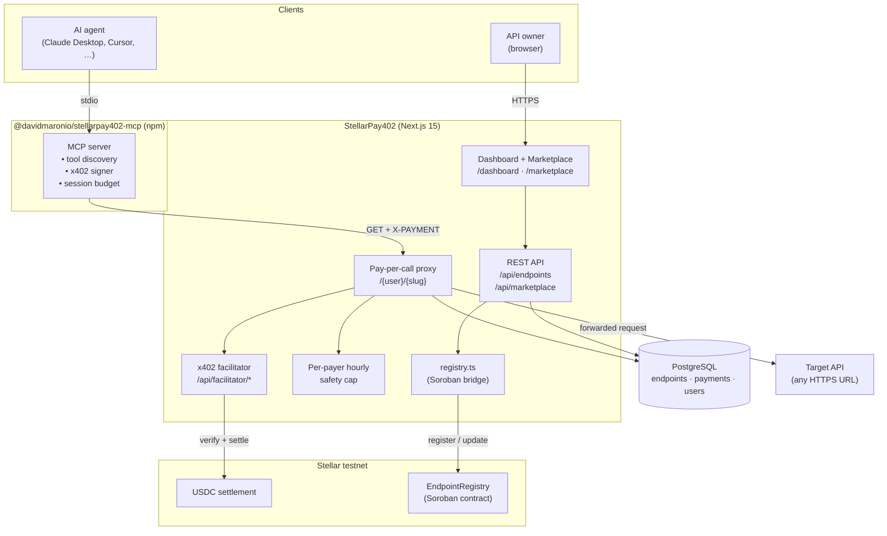

# StellarPay402

A self-serve marketplace for monetizing HTTP APIs with x402 micropayments on Stellar. Developers register endpoints and set a USDC price per request; AI agents discover them through an MCP server and pay autonomously.

Built for [Stellar Hacks: Agents 2026](https://dorahacks.io).

## Problem

APIs today are either free (and unsustainable) or behind subscriptions (and inaccessible to short-lived or machine consumers). There is no lightweight, standardized way to charge per individual request, and no way for an autonomous AI agent to discover a paid API and complete payment on its own.

The HTTP 402 status code was reserved for this purpose decades ago but went unused until the x402 protocol revived it. Even with x402, three gaps remain:

1. **Integration effort.** Developers who want to monetize an existing API must write custom middleware to verify payments, forward requests, and settle on-chain.
2. **Discovery.** There is no public catalog where a client, human or otherwise, can find paid APIs and their prices.
3. **Autonomy.** AI agents cannot pay for tools they discover at runtime — someone has to write wallet code, sign transactions, and handle payment headers by hand.

## Solution

StellarPay402 closes all three gaps in a single application.

- **For the API owner**, the dashboard takes a target URL and a USDC price and returns a paid proxy URL. No code changes are required on the owner's side.
- **For any client**, the public marketplace lists every available endpoint with its price, provider, and recent on-chain receipts.
- **For AI agents**, the companion MCP server (`@davidmaronio/stellarpay402-mcp`) turns the marketplace into a live tool catalog. The agent calls a tool like any other; the MCP server signs an x402 payment and returns the API response together with a Stellar Expert transaction link.

A `register` event is additionally emitted on the `EndpointRegistry` Soroban contract whenever an endpoint is created, so the catalog itself has an on-chain provenance trail independent of the hosted marketplace.

## Overview

StellarPay402 is composed of four parts that live in one repository:

- A **Next.js web application** that hosts the marketplace, dashboard, public catalog, and per-endpoint receipts pages.
- A **pay-per-call proxy** at `/{userSlug}/{slug}` that returns HTTP 402 with x402 payment requirements to unauthenticated callers and forwards authenticated calls to the target API.
- A **self-hosted x402 facilitator** at `/api/facilitator/*` that verifies and settles payments on Stellar testnet using `@x402/stellar`.
- An **MCP server** (`@davidmaronio/stellarpay402-mcp`) that exposes every marketplace endpoint as a tool to any MCP-aware AI assistant, signing x402 payments on the agent's behalf.
- A **Soroban smart contract** (`EndpointRegistry`) that anchors every endpoint registration on-chain and accepts on-chain reputation attestations from payers.

## Architecture



## Repository layout

```
StellarPay402/
├── src/app/
│   ├── [userSlug]/[...path]/route.ts      Pay-per-call proxy handler
│   ├── api/facilitator/[[...path]]/       Embedded x402 facilitator
│   ├── api/endpoints/                     Authenticated endpoint CRUD
│   ├── api/marketplace/                   Public catalog + per-endpoint receipts
│   ├── marketplace/                       Public marketplace pages
│   ├── dashboard/                         Authenticated dashboard
│   └── (auth)/                            Login + register
├── src/lib/
│   ├── auth.ts                            better-auth configuration
│   ├── db/                                Drizzle schema + Postgres client
│   └── registry.ts                        Soroban EndpointRegistry bridge
├── mcp-server/                            @davidmaronio/stellarpay402-mcp npm package
├── contracts/endpoint_registry/           Soroban smart contract (Rust)
├── scripts/test-payment.mjs               End-to-end x402 payment test
└── docs/
    ├── PRD.md                             Product requirements
    └── DEMO_SCRIPT.md                     Demo video script
```

## Prerequisites

- Node.js 20 or later
- A PostgreSQL database (Supabase free tier works)
- A Stellar testnet account for the facilitator signer
- Optional: `soroban-cli` and a Rust toolchain to build and deploy the contract

## Getting started

```bash
git clone https://github.com/davidmaronio/StellarPay402
cd StellarPay402
cp .env.local.example .env.local
npm install
npx drizzle-kit push
npm run dev
```

Open <http://localhost:3000>, sign in, and create an endpoint from the dashboard. It will immediately appear at `/{userSlug}/{slug}` and in the public marketplace at `/marketplace`.

## Environment variables

| Variable | Required | Description |
| --- | --- | --- |
| `DATABASE_URL` | yes | PostgreSQL connection string |
| `BETTER_AUTH_SECRET` | yes | 32+ character secret for session encryption |
| `BETTER_AUTH_URL` | yes | Public URL of the app (e.g. `http://localhost:3000`) |
| `NEXT_PUBLIC_APP_URL` | yes | Public URL of the app, exposed to the client for proxy/MCP snippets |
| `GITHUB_CLIENT_ID` / `GITHUB_CLIENT_SECRET` | no | Enables GitHub OAuth login |
| `FACILITATOR_SECRET_KEY` | yes | Stellar testnet secret key the embedded facilitator uses to sign settlement transactions |
| `STELLAR_RPC_URL` | no | Defaults to `https://soroban-testnet.stellar.org` |
| `STELLAR_FACILITATOR_URL` | no | Defaults to the embedded `/api/facilitator` route |
| `MAX_PAYER_SPEND_PER_HOUR_USDC` | no | Per-payer hourly safety cap (defaults to `1.0`) |
| `REGISTRY_CONTRACT_ID` | no | Deployed `EndpointRegistry` contract ID. Leave blank to skip on-chain anchoring. |
| `REGISTRY_SUBMITTER_SECRET` | no | Secret key used to submit registry transactions. Falls back to `FACILITATOR_SECRET_KEY`. |

## Core flows

### Pay-per-call proxy

```
Caller → GET /:user/:slug
          ↓  no X-PAYMENT header
Server → 402 + x402 payment requirements (Stellar testnet, USDC)

Caller signs an x402 payment with @x402/stellar
Caller → GET /:user/:slug  (X-PAYMENT: <base64>)
          ↓  verify via facilitator → simulate → settle on Stellar
Server → forward to target URL → return response + X-Payment-Receipt header
```

### End-to-end payment test

The repository includes a reference client that exercises the full flow against a locally running app:

```bash
node scripts/test-payment.mjs
```

The script creates a fresh testnet keypair, funds it via Friendbot, establishes a USDC trustline, swaps XLM for USDC on the testnet DEX, calls the proxy without payment (expects 402), builds an x402 payment with the SDK, calls again with the payment header (expects 200), and prints the Stellar Expert link for the settled transaction.

### Safety guardrail

The proxy enforces a hard per-payer spending cap. After each verify, it queries the `payments` table for the caller's cumulative spend in the last hour and rejects the request if the new payment would exceed `MAX_PAYER_SPEND_PER_HOUR_USDC`. This is a server-side control that cannot be bypassed by a misbehaving client.

### MCP integration

See [`mcp-server/README.md`](./mcp-server/README.md) for installation and configuration details. In short, an AI agent that loads the `@davidmaronio/stellarpay402-mcp` MCP server gains a live tool catalog sourced from the marketplace and can call any endpoint without writing payment code — the MCP server signs the x402 payment on its behalf and enforces a client-side session budget.

### Soroban EndpointRegistry

See [`contracts/endpoint_registry/README.md`](./contracts/endpoint_registry/README.md). When `REGISTRY_CONTRACT_ID` is set, every `POST /api/endpoints` call additionally submits a `register` transaction to the contract, emitting an on-chain event containing the owner, payout address, price (in stroops), and endpoint name. The contract also exposes `update` (owner-only) and `attest` (payer reputation) functions.

## Tech stack

| Layer | Choice |
| --- | --- |
| Framework | Next.js 15 (App Router) |
| Database | PostgreSQL + Drizzle ORM |
| Auth | better-auth |
| Payments | x402 v2 (`@x402/core`, `@x402/stellar`) |
| Smart contract | Soroban, Rust |
| MCP runtime | `@modelcontextprotocol/sdk` |
| Deployment | Vercel (web), Supabase (database) |

## Documentation

- Product requirements: [`docs/PRD.md`](./docs/PRD.md)
- MCP server: [`mcp-server/README.md`](./mcp-server/README.md)
- Soroban contract: [`contracts/endpoint_registry/README.md`](./contracts/endpoint_registry/README.md)

## License

MIT
