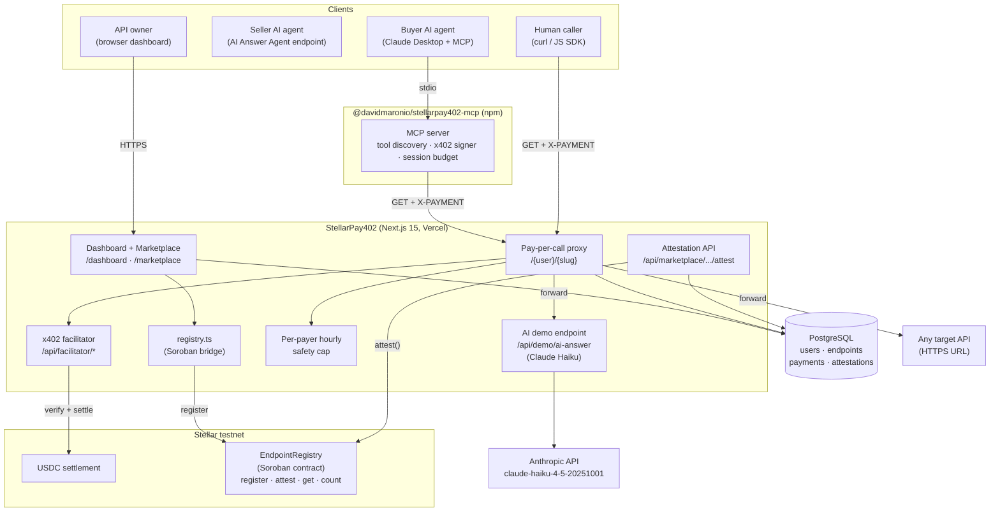

# StellarPay402

The first agent-to-agent API marketplace on Stellar. One AI agent lists its output as a paid endpoint. Another AI agent discovers it via MCP, pays $0.01 USDC, and gets the response — no humans, no code, no approval needed. Every listing, payment, and reputation score is anchored on a Soroban smart contract.

Built for [Stellar Hacks: Agents 2026](https://dorahacks.io).

| | |
|---|---|
| **Live demo** | <https://stellar-pay402.vercel.app> |
| **npm (MCP server)** | <https://www.npmjs.com/package/@davidmaronio/stellarpay402-mcp> |
| **Soroban contract** | `CCCCETOWJQQPIGRKSJW7M4ULM7MBKIVTIRLA7NJTVSGR3XG2KSZZXYA7` (testnet) |
| **Stellar Expert** | [View contract](https://stellar.expert/explorer/testnet/contract/CCCCETOWJQQPIGRKSJW7M4ULM7MBKIVTIRLA7NJTVSGR3XG2KSZZXYA7) |

---

## Why this exists

**The agent-to-agent problem.** Most APIs are free or behind a subscription. Free APIs break. Subscription APIs need a human with a credit card, so an AI agent cannot pay for them autonomously.

StellarPay402 removes every human from the loop:

- **Seller agent** — an AI-powered endpoint listed in the marketplace (e.g. the built-in AI Answer Agent backed by Claude Haiku)
- **Buyer agent** — Claude Desktop, Cursor, or any MCP client configured with `@davidmaronio/stellarpay402-mcp`
- **Settlement** — USDC on Stellar testnet via x402, 5-second finality, sub-cent fees
- **Reputation** — on-chain attestations anchored to the Soroban EndpointRegistry after every paid call

HTTP 402 was reserved for "Payment Required" in 1996. The x402 protocol finally makes it work. StellarPay402 adds the missing pieces: a public catalog, a self-hosted facilitator, MCP auto-discovery, and on-chain reputation.

---

## How it works

**For API owners (sellers):** Go to the dashboard, paste your HTTPS URL, set a USDC price per call. You get a paid proxy URL back. Mark it "AI-powered" if the endpoint is backed by an AI model. Nothing changes on your side.

**For AI agents (buyers):** Install `@davidmaronio/stellarpay402-mcp` from npm. Add one block to your Claude Desktop or Cursor config. Every public endpoint in the marketplace shows up as a callable tool — with the price baked in. When the AI calls a tool, the MCP server signs the x402 payment with its configured Stellar wallet and returns the API response plus a Stellar Expert link.

**For reputation:** After a paid call, any caller can leave a 1–5 star attestation with a comment. The attestation is saved to the DB **and** anchored on the Soroban `EndpointRegistry` contract via `attest()`. The real caller's Stellar address is recorded on-chain permanently. Ratings appear on marketplace cards and the endpoint detail page.

**Agent-to-agent in practice:**
```
Claude Desktop (buyer agent)
  → discovers "AI Answer Agent" tool via MCP
  → calls tool with question
  → MCP server signs x402 payment ($0.01 USDC)
  → proxy verifies + settles on Stellar
  → forwards request to /api/demo/ai-answer
  → Claude Haiku generates answer
  → response returned to buyer agent
  → buyer agent submits star rating → anchored on Soroban
```
Zero humans in the loop at any step.

---

## What is in the repo

- **Next.js 15 web app** — marketplace, dashboard, public catalog, receipts, and star rating pages
- **Pay-per-call proxy** at `/{userSlug}/{slug}` — returns HTTP 402 without payment, forwards with payment
- **Self-hosted x402 facilitator** at `/api/facilitator/*` — embedded `@x402/core` + `@x402/stellar`, no external dependency
- **MCP server** (`@davidmaronio/stellarpay402-mcp`) — published on npm, exposes every marketplace endpoint as an MCP tool
- **AI demo endpoint** at `/api/demo/ai-answer` — Claude Haiku-powered Q&A, the built-in "seller agent"
- **Attestation API** at `/api/marketplace/{user}/{slug}/attest` — saves ratings to DB + calls Soroban `attest()`
- **Soroban contract** in Rust under `contracts/endpoint_registry/` — `register`, `update`, `attest`, `get`, `count`
- **Per-payer safety cap** — hourly USDC spend limit enforced at the proxy layer, stops runaway agents

---

## Architecture



---

## Project layout

```
StellarPay402/
├── src/app/
│   ├── [userSlug]/[...path]/route.ts          Pay-per-call proxy
│   ├── api/
│   │   ├── facilitator/[[...path]]/           Embedded x402 facilitator
│   │   ├── endpoints/                         Authenticated endpoint CRUD
│   │   ├── marketplace/                       Public catalog API
│   │   │   └── [userSlug]/[slug]/
│   │   │       ├── receipts/                  On-chain payment receipts
│   │   │       └── attest/                    POST — submit star attestation
│   │   ├── demo/ai-answer/                    Built-in Claude Haiku endpoint
│   │   └── mcp/[userSlug]/[slug]/             MCP tool definition per endpoint
│   ├── marketplace/                           Public marketplace pages
│   │   └── [userSlug]/[slug]/                 Endpoint detail + receipts + ratings
│   ├── dashboard/                             Authenticated dashboard
│   │   └── endpoints/new/                     New endpoint form (AI-powered toggle)
│   └── (auth)/                                Login + register
├── src/components/ui/
│   ├── marketing-header.tsx                   Scroll-aware public nav
│   ├── app-header.tsx                         Authenticated nav
│   ├── attest-form.tsx                        Star rating form (client component)
│   └── ...
├── src/lib/
│   ├── auth.ts                                better-auth config
│   ├── db/schema.ts                           Drizzle schema (users, endpoints, payments, attestations)
│   └── registry.ts                            Soroban bridge (register + attest)
├── mcp-server/                                @davidmaronio/stellarpay402-mcp
├── contracts/endpoint_registry/              Soroban contract (Rust)
├── scripts/
│   ├── test-payment.mjs                       End-to-end x402 payment test
│   ├── reanchor-all.mjs                       Re-anchor all endpoints after contract redeploy
│   ├── migrate-attestations.mjs               Create attestations table
│   └── migrate-ai-powered.mjs                 Add is_ai_powered column
└── docs/PRD.md
```

---

## Running locally

```bash
git clone https://github.com/davidmaronio/StellarPay402
cd StellarPay402
cp .env.local.example .env.local   # fill in the variables below
npm install
node scripts/migrate-attestations.mjs   # create attestations table
node scripts/migrate-ai-powered.mjs     # create is_ai_powered column
npm run dev
```

> **Note:** `drizzle-kit push` has a known bug with check constraints on Supabase (drizzle-kit 0.31.x). Use the migration scripts above instead.

---

## Environment variables

| Variable | Required | Description |
|---|---|---|
| `DATABASE_URL` | yes | PostgreSQL connection string (Supabase transaction pooler recommended) |
| `BETTER_AUTH_SECRET` | yes | 32+ character secret for session encryption |
| `BETTER_AUTH_URL` | yes | Public URL of the app (`http://localhost:3000` for local) |
| `NEXT_PUBLIC_APP_URL` | yes | Same URL, exposed to client for proxy + MCP snippets |
| `GITHUB_CLIENT_ID` / `GITHUB_CLIENT_SECRET` | no | GitHub OAuth login |
| `FACILITATOR_SECRET_KEY` | yes | Stellar testnet secret key for the embedded x402 facilitator |
| `STELLAR_RPC_URL` | no | Defaults to `https://soroban-testnet.stellar.org` |
| `STELLAR_FACILITATOR_URL` | no | Defaults to embedded `/api/facilitator` |
| `MAX_PAYER_SPEND_PER_HOUR_USDC` | no | Per-payer hourly safety cap. Default `1.0` |
| `REGISTRY_CONTRACT_ID` | no | Soroban EndpointRegistry contract ID. Skip to disable on-chain anchoring |
| `REGISTRY_SUBMITTER_SECRET` | no | Secret key for registry transactions. Falls back to `FACILITATOR_SECRET_KEY` |
| `ANTHROPIC_API_KEY` | no | Enables real Claude Haiku responses on `/api/demo/ai-answer`. Falls back to a smart mock if unset |

---

## How a paid call works

```
Caller  →  GET /{user}/{slug}
           (no X-PAYMENT header)
Server  ←  402 + x402 payment requirements (Stellar testnet, USDC, amount, facilitator URL)

Caller signs x402 payment with @x402/stellar
Caller  →  GET /{user}/{slug}  (X-PAYMENT: <base64 payload>)
           facilitator verifies signature
           USDC settles on Stellar testnet
           proxy forwards to target URL
Server  ←  200 + API response + X-Payment-Receipt header
           payment logged to DB + public receipts page
```

---

## Demo AI endpoint (agent-to-agent)

The repo ships a built-in AI endpoint at `/api/demo/ai-answer`. Register it once in the dashboard with "AI-powered" checked — it becomes the **seller agent** in the marketplace. Any buyer agent (Claude Desktop via MCP) can then discover it, pay, and receive a Claude-generated answer.

```bash
# Direct call (no payment wall — this is the raw target URL)
curl "https://stellar-pay402.vercel.app/api/demo/ai-answer?q=What+is+x402"

# Response
{
  "question": "What is x402",
  "answer": "x402 is an HTTP micropayment protocol...",
  "model": "claude-haiku-4-5-20251001",
  "latencyMs": 1700,
  "paidVia": "x402 · Stellar testnet · USDC",
  "poweredBy": "StellarPay402 agent-to-agent marketplace",
  "generatedAt": "2026-04-09T..."
}
```

Register it as a paid endpoint (e.g. at `/n4buhayk/ai-agent`) and it becomes gated — callers must pay $0.01 USDC before getting the answer.

---

## On-chain attestations (reputation)

After a paid call, callers can leave a 1–5 star rating on the endpoint detail page. The rating is:

1. Saved to the `attestations` table in PostgreSQL
2. Submitted to the Soroban `attest()` function — emitting a permanent `("att", endpoint_id, payer)` event on Stellar

The caller's real Stellar `G...` address is anchored on-chain for attribution. No auth is required on the contract — the economic cost of the preceding x402 payment is the spam filter.

Ratings appear:
- As a ★ inline on every marketplace card
- As a stat card (avg rating + review count) on the endpoint detail page
- As a scrollable list of reviews with Stellar Expert links
- In the Soroban contract event log, independently verifiable by anyone

---

## Safety cap

The proxy has a built-in per-payer hourly spending cap. After every successful verify, it checks the `payments` table for the calling address. If accepting the new payment would push their total over `MAX_PAYER_SPEND_PER_HOUR_USDC` in the last hour, the proxy rejects with a clear error. This runs on the server — a misbehaving agent cannot bypass it.

---

## Test the whole flow

```bash
node scripts/test-payment.mjs
```

This script:
1. Generates a fresh Stellar testnet wallet
2. Funds it via Friendbot
3. Sets up a USDC trustline
4. Swaps XLM → USDC on the testnet DEX
5. Calls the proxy without payment → expects HTTP 402
6. Signs an x402 payment with `@x402/stellar`
7. Calls again with `X-PAYMENT` header → expects 200
8. Prints the Stellar Expert link to the real settled transaction

---

## MCP server

See [`mcp-server/README.md`](./mcp-server/README.md). One block in Claude Desktop config → restart → every marketplace endpoint appears as a paid tool. When called, the MCP server signs the x402 payment and returns the API response with a Stellar Expert receipt link.

---

## Soroban EndpointRegistry

See [`contracts/endpoint_registry/README.md`](./contracts/endpoint_registry/README.md).

**Live contract (testnet):** `CCCCETOWJQQPIGRKSJW7M4ULM7MBKIVTIRLA7NJTVSGR3XG2KSZZXYA7`

Functions: `init` · `register` (owner auth) · `update` (owner auth) · `attest` (open, no auth) · `get` · `count`

Every new endpoint → `register` tx → on-chain event. Every attestation → `attest` tx → permanent reputation event. If the website goes down, the full catalog and reputation history can be rebuilt from Stellar event logs.

**Redeploying the contract:**
```bash
# After a redeploy, re-anchor all existing endpoints to the new contract:
node scripts/reanchor-all.mjs
```

---

## Which x402 packages this uses

| Package | Version | Role |
|---|---|---|
| `@x402/core` | `^2.9.0` | Protocol core — backs the embedded `/api/facilitator` route |
| `@x402/stellar` | `^2.9.0` | Stellar half of x402 — `ExactStellarScheme` for verify/settle and client signing |
| `@stellar/stellar-sdk` | `^15.0.1` | Build, sign, submit Stellar txs + Soroban contract calls |
| `@modelcontextprotocol/sdk` | `^1.0.4` | MCP server stdio transport, `tools/list`, `tools/call` |

These are the canonical packages from the [Stellar x402 quickstart](https://developers.stellar.org/docs/build/agentic-payments/x402/quickstart-guide), maintained by the Coinbase x402 team. The protocol version is x402 v2 (`exact` scheme).

---

## Tech stack

| Layer | Choice |
|---|---|
| Framework | Next.js 15 (App Router) |
| Database | PostgreSQL + Drizzle ORM (Supabase) |
| Auth | better-auth (email/password + GitHub OAuth) |
| Payments | x402 v2 — `@x402/core`, `@x402/stellar` |
| AI (demo endpoint) | Claude Haiku (`claude-haiku-4-5-20251001`) via Anthropic API |
| Smart contract | Soroban (Rust, `soroban-sdk` v21) |
| MCP runtime | `@modelcontextprotocol/sdk` |
| Deployment | Vercel (app) · Supabase (database) |

---

## Docs

- Product requirements: [`docs/PRD.md`](./docs/PRD.md)
- MCP server: [`mcp-server/README.md`](./mcp-server/README.md)
- Soroban contract: [`contracts/endpoint_registry/README.md`](./contracts/endpoint_registry/README.md)

## License

MIT
