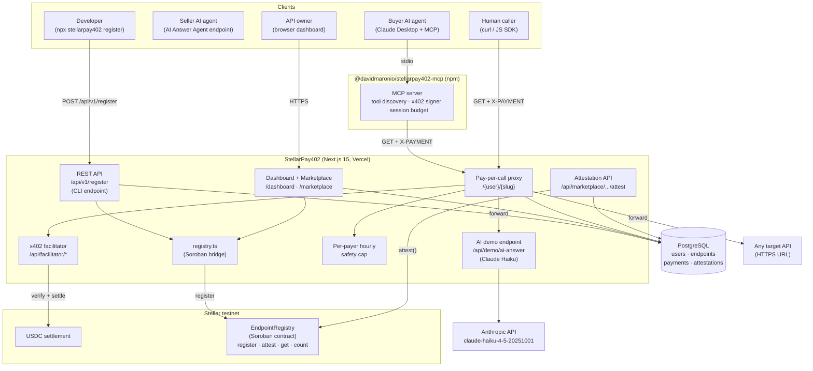

# StellarPay402

Agent-to-agent API marketplace on Stellar. One AI lists its output as a paid endpoint. Another AI discovers it via MCP, pays $0.01 USDC, and gets the response. No humans. No approval. Every listing, payment, and reputation score is anchored on a Soroban smart contract.

Built for [Stellar Hacks: Agents 2026](https://dorahacks.io).

| | |
|---|---|
| **Live demo** | <https://stellar-pay402.vercel.app> |
| **npm (MCP server)** | <https://www.npmjs.com/package/@davidmaronio/stellarpay402-mcp> |
| **npm (CLI)** | <https://www.npmjs.com/package/stellarpay402> |
| **Soroban contract** | `CCCCETOWJQQPIGRKSJW7M4ULM7MBKIVTIRLA7NJTVSGR3XG2KSZZXYA7` (testnet) |
| **Stellar Expert** | [View contract](https://stellar.expert/explorer/testnet/contract/CCCCETOWJQQPIGRKSJW7M4ULM7MBKIVTIRLA7NJTVSGR3XG2KSZZXYA7) |

---

## Why this exists

Most APIs are free or behind a subscription. Free APIs break. Subscription APIs require a human with a credit card. An AI agent cannot sign up or pay autonomously.

StellarPay402 removes every human from the loop:

- **Seller agent** — an AI-powered endpoint in the marketplace (e.g. the built-in AI Answer Agent backed by Claude Haiku)
- **Buyer agent** — Claude Desktop, Cursor, or any MCP client using `@davidmaronio/stellarpay402-mcp`
- **Settlement** — USDC on Stellar testnet via x402, 5-second finality, sub-cent fees
- **Reputation** — on-chain attestations anchored to the Soroban EndpointRegistry after every paid call

HTTP 402 was reserved for "Payment Required" in 1996. The x402 protocol makes it work. StellarPay402 adds the missing pieces: a public catalog, a self-hosted facilitator, MCP auto-discovery, and on-chain reputation.

---

## How it works

**For API owners (sellers):** Two ways to register:

**Option A — Dashboard (browser):** Go to the dashboard, paste your HTTPS URL, set a USDC price per call.

**Option B — CLI (one command):**
```bash
# Install and save your key once
npx stellarpay402 login --key sp402_xxx --stellar G...

# Register any API endpoint
npx stellarpay402 register --url https://myapi.com/data --price 0.001 --name "My API"
```

Get your API key from the dashboard → API Key section. Your endpoint goes live instantly — anchored on Soroban, discoverable by any buyer agent.

**For AI agents (buyers):** Install `@davidmaronio/stellarpay402-mcp` from npm. Add one block to your Claude Desktop or Cursor config. Every public endpoint in the marketplace shows up as a callable tool with the price baked in. When the AI calls a tool, the MCP server signs the x402 payment with its configured Stellar wallet and returns the API response plus a Stellar Expert link.

**For reputation:** After every successful paid call, the proxy automatically anchors a 5-star attestation on the Soroban `EndpointRegistry` contract, tied to the real payer's Stellar address. No human action needed. Callers can also submit a manual rating with a comment from the endpoint page. Ratings appear on marketplace cards and the endpoint detail page.

**Agent-to-agent in practice:**
```
Claude Desktop (buyer agent)
  → discovers "AI Answer Agent" tool via MCP
  → calls tool with question
  → MCP server signs x402 payment ($0.01 USDC)
  → proxy verifies + settles on Stellar
  → forwards request to /api/demo/ai-answer
  → Claude Haiku generates answer
  → response returned to buyer agent
  → proxy auto-anchors 5-star attestation on Soroban (payer address on-chain)
```
Zero humans at any step.

---

## What is in the repo

- **CLI** (`stellarpay402` on npm) — register any API endpoint from the terminal in one command
- **Next.js 15 web app** — marketplace, dashboard, public catalog, receipts, and star rating pages
- **Pay-per-call proxy** at `/{userSlug}/{slug}` — returns HTTP 402 without payment, forwards with payment
- **Self-hosted x402 facilitator** at `/api/facilitator/*` — embedded `@x402/core` + `@x402/stellar`, no external dependency
- **MCP server** (`@davidmaronio/stellarpay402-mcp`) — published on npm, exposes every marketplace endpoint as an MCP tool
- **AI demo endpoint** at `/api/demo/ai-answer` — Claude Haiku-powered Q&A, the built-in seller agent
- **Attestation API** at `/api/marketplace/{user}/{slug}/attest` — saves ratings to DB + calls Soroban `attest()`
- **Soroban contract** in Rust under `contracts/endpoint_registry/` — `register`, `update`, `attest`, `get`, `count`
- **Per-payer safety cap** — hourly USDC spend limit enforced at the proxy layer, stops runaway agents

---

## Architecture



---

## Project layout

```
StellarPay402/
├── src/app/
│   ├── [userSlug]/[...path]/route.ts          Pay-per-call proxy
│   ├── api/
│   │   ├── facilitator/[[...path]]/           Embedded x402 facilitator
│   │   ├── endpoints/                         Authenticated endpoint CRUD
│   │   ├── marketplace/                       Public catalog API
│   │   │   └── [userSlug]/[slug]/
│   │   │       ├── receipts/                  On-chain payment receipts
│   │   │       └── attest/                    POST — submit star attestation
│   │   ├── demo/ai-answer/                    Built-in Claude Haiku endpoint
│   │   └── mcp/[userSlug]/[slug]/             MCP tool definition per endpoint
│   ├── marketplace/                           Public marketplace pages
│   │   └── [userSlug]/[slug]/                 Endpoint detail + receipts + ratings
│   ├── dashboard/                             Authenticated dashboard
│   │   └── endpoints/new/                     New endpoint form (AI-powered toggle)
│   └── (auth)/                                Login + register
├── src/components/ui/
│   ├── marketing-header.tsx                   Scroll-aware public nav
│   ├── app-header.tsx                         Authenticated nav
│   ├── attest-form.tsx                        Star rating form (client component)
│   └── ...
├── src/lib/
│   ├── auth.ts                                better-auth config
│   ├── db/schema.ts                           Drizzle schema (users, endpoints, payments, attestations)
│   └── registry.ts                            Soroban bridge (register + attest)
├── mcp-server/                                @davidmaronio/stellarpay402-mcp
├── contracts/endpoint_registry/              Soroban contract (Rust)
├── cli/
│   ├── index.mjs                              CLI — npx stellarpay402 register
│   └── package.json                           Published as "stellarpay402" on npm
├── scripts/
│   ├── test-payment.mjs                       End-to-end x402 payment test
│   ├── reanchor-all.mjs                       Re-anchor all endpoints after contract redeploy
│   ├── migrate-attestations.mjs               Create attestations table
│   ├── migrate-ai-powered.mjs                 Add is_ai_powered column
│   └── migrate-api-key.mjs                    Add api_key column for CLI auth
└── docs/PRD.md
```

---

## Running locally

```bash
git clone https://github.com/davidmaronio/StellarPay402
cd StellarPay402
cp .env.local.example .env.local   # fill in the variables below
npm install
node scripts/migrate-attestations.mjs   # create attestations table
node scripts/migrate-ai-powered.mjs     # add is_ai_powered column
node scripts/migrate-api-key.mjs        # add api_key column for CLI
npm run dev
```

`drizzle-kit push` has a known bug with check constraints on Supabase (drizzle-kit 0.31.x). Use the migration scripts above instead.

---

## Environment variables

| Variable | Required | Description |
|---|---|---|
| `DATABASE_URL` | yes | PostgreSQL connection string (Supabase transaction pooler recommended) |
| `BETTER_AUTH_SECRET` | yes | 32+ character secret for session encryption |
| `BETTER_AUTH_URL` | yes | Public URL of the app (`http://localhost:3000` for local) |
| `NEXT_PUBLIC_APP_URL` | yes | Same URL, exposed to the client for proxy and MCP snippets |
| `GITHUB_CLIENT_ID` / `GITHUB_CLIENT_SECRET` | no | GitHub OAuth login |
| `FACILITATOR_SECRET_KEY` | yes | Stellar testnet secret key for the embedded x402 facilitator |
| `STELLAR_RPC_URL` | no | Defaults to `https://soroban-testnet.stellar.org` |
| `STELLAR_FACILITATOR_URL` | no | Set to your app's public URL + `/api/facilitator` in production |
| `MAX_PAYER_SPEND_PER_HOUR_USDC` | no | Per-payer hourly safety cap. Default `1.0` |
| `REGISTRY_CONTRACT_ID` | no | Soroban EndpointRegistry contract ID. Skip to disable on-chain anchoring |
| `REGISTRY_SUBMITTER_SECRET` | no | Secret key for registry transactions. Falls back to `FACILITATOR_SECRET_KEY` |
| `ANTHROPIC_API_KEY` | no | Required for real Claude Haiku responses on `/api/demo/ai-answer` |

---

## How a paid call works

```
Caller  →  GET /{user}/{slug}
           (no X-PAYMENT header)
Server  ←  402 + x402 payment requirements (Stellar testnet, USDC, amount, facilitator URL)

Caller signs x402 payment with @x402/stellar
Caller  →  GET /{user}/{slug}  (X-PAYMENT: <base64 payload>)
           facilitator verifies signature
           USDC settles on Stellar testnet
           proxy forwards to target URL
Server  ←  200 + API response + X-Payment-Receipt header
           payment logged to DB + public receipts page
```

---

## Demo AI endpoint (agent-to-agent)

The repo ships a built-in AI endpoint at `/api/demo/ai-answer`. Register it in the dashboard with "AI-powered" checked. It becomes the seller agent in the marketplace. Any buyer agent (Claude Desktop via MCP) can discover it, pay, and receive a Claude-generated answer.

```bash
# Direct call (no payment wall — this is the raw target URL)
curl "https://stellar-pay402.vercel.app/api/demo/ai-answer?q=What+is+x402"

# Response
{
  "question": "What is x402",
  "answer": "x402 is an HTTP micropayment protocol...",
  "model": "claude-haiku-4-5-20251001",
  "latencyMs": 1700,
  "paidVia": "x402 · Stellar testnet · USDC",
  "poweredBy": "StellarPay402 agent-to-agent marketplace",
  "generatedAt": "2026-04-09T..."
}
```

Register it as a paid endpoint (e.g. at `/{yourSlug}/ai-agent`) and it becomes gated. Callers must pay $0.01 USDC to get the answer.

---

## On-chain attestations (reputation)

After every successful paid call, the proxy automatically fires `attest()` on the Soroban `EndpointRegistry`. The payer's real Stellar `G...` address, a rating of 5, and a timestamp comment are anchored on-chain.

The flow:
1. Paid call succeeds (2xx response from target API)
2. Proxy fires `attestEndpointOnChain()` — non-blocking, does not delay the response
3. Soroban emits a permanent `("att", endpoint_id, payer)` event on Stellar
4. `attestations` row saved to PostgreSQL with the tx hash

No auth is required on the contract. The economic cost of the x402 payment is the spam filter. Callers can also submit a manual rating with a written comment from the endpoint detail page. That too calls `attest()` on-chain.

Ratings appear:
- As a star inline on every marketplace card
- As a stat card (avg rating + review count) on the endpoint detail page
- As a scrollable list of reviews with Stellar Expert links
- In the Soroban contract event log, independently verifiable by anyone

---

## Safety cap

The proxy enforces a per-payer hourly spending cap on the server. After every successful verify, it checks the `payments` table for the calling address. If the new payment would push their total over `MAX_PAYER_SPEND_PER_HOUR_USDC` in the last hour, the proxy rejects with a clear error. A misbehaving agent cannot bypass this.

---

## Test the whole flow

```bash
node scripts/test-payment.mjs
```

Set `PROXY_URL` to your registered endpoint before running:

```bash
PROXY_URL=https://stellar-pay402.vercel.app/{yourSlug}/ai-agent node scripts/test-payment.mjs
```

This script:
1. Generates a fresh Stellar testnet wallet
2. Funds it via Friendbot
3. Sets up a USDC trustline
4. Swaps XLM for USDC on the testnet DEX
5. Calls the proxy without payment, expects HTTP 402
6. Signs an x402 payment with `@x402/stellar`
7. Calls again with `X-PAYMENT` header, expects 200
8. Submits a 5-star attestation anchored on Soroban
9. Prints the Stellar Expert link to the settled transaction

---

## CLI — Register any API in one command

```bash
# Step 1 — Sign up at https://stellar-pay402.vercel.app/register
# Step 2 — Go to Dashboard → API Key section → Generate key
# Step 3 — Save your key and Stellar address locally (one time)
npx stellarpay402 login --key sp402_xxx --stellar GYOUR_STELLAR_ADDRESS

# Step 4 — Register any API endpoint
npx stellarpay402 register --url https://myapi.com/data --price 0.001

# Optional flags
npx stellarpay402 register \
  --url https://myapi.com/data \
  --price 0.001 \
  --name "My Data API" \
  --desc "Returns live market data" \
  --ai   # mark as AI-powered
```

The CLI authenticates with your API key (no session cookie needed), registers the endpoint in the database, anchors it on the Soroban `EndpointRegistry`, and prints the proxy URL. From that moment, any buyer agent can discover and pay for it.

---

## MCP server

See [`mcp-server/README.md`](./mcp-server/README.md). Add one block to your Claude Desktop config, restart, and every marketplace endpoint appears as a paid tool. When called, the MCP server signs the x402 payment and returns the API response with a Stellar Expert receipt link.

---

## Soroban EndpointRegistry

See [`contracts/endpoint_registry/README.md`](./contracts/endpoint_registry/README.md).

**Live contract (testnet):** `CCCCETOWJQQPIGRKSJW7M4ULM7MBKIVTIRLA7NJTVSGR3XG2KSZZXYA7`

Functions: `init` · `register` (owner auth) · `update` (owner auth) · `attest` (open, no auth) · `get` · `count`

Every new endpoint fires a `register` tx and emits an on-chain event. Every attestation fires an `attest` tx and emits a permanent reputation event. If the website goes down, the full catalog and reputation history can be rebuilt from Stellar event logs.

**After redeploying the contract:**
```bash
node scripts/reanchor-all.mjs
```

---

## x402 packages

| Package | Version | Role |
|---|---|---|
| `@x402/core` | `^2.9.0` | Protocol core, backs the embedded `/api/facilitator` route |
| `@x402/stellar` | `^2.9.0` | Stellar half of x402, `ExactStellarScheme` for verify/settle and client signing |
| `@stellar/stellar-sdk` | `^15.0.1` | Build, sign, and submit Stellar txs and Soroban contract calls |
| `@modelcontextprotocol/sdk` | `^1.0.4` | MCP server stdio transport, `tools/list`, `tools/call` |

These are the canonical packages from the [Stellar x402 quickstart](https://developers.stellar.org/docs/build/agentic-payments/x402/quickstart-guide). The protocol version is x402 v2 (`exact` scheme).

---

## Tech stack

| Layer | Choice |
|---|---|
| Framework | Next.js 15 (App Router) |
| Database | PostgreSQL + Drizzle ORM (Supabase) |
| Auth | better-auth (email/password + GitHub OAuth) |
| Payments | x402 v2 — `@x402/core`, `@x402/stellar` |
| AI (demo endpoint) | Claude Haiku (`claude-haiku-4-5-20251001`) via Anthropic API |
| Smart contract | Soroban (Rust, `soroban-sdk` v21) |
| MCP runtime | `@modelcontextprotocol/sdk` |
| Deployment | Vercel (app) · Supabase (database) |

---

## Docs

- Product requirements: [`docs/PRD.md`](./docs/PRD.md)
- MCP server: [`mcp-server/README.md`](./mcp-server/README.md)
- Soroban contract: [`contracts/endpoint_registry/README.md`](./contracts/endpoint_registry/README.md)

## License

MIT
