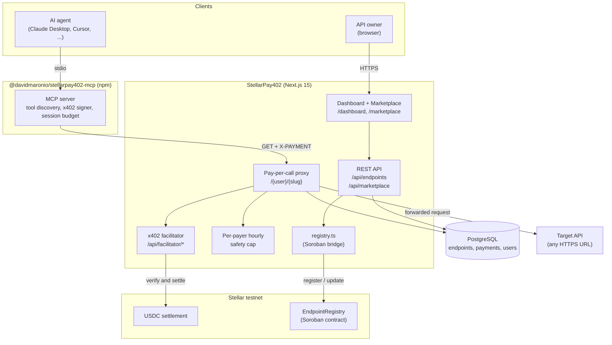

# StellarPay402

StellarPay402 is a marketplace for paid HTTP APIs. Developers list an endpoint and set a USDC price. AI agents find it through MCP and pay for it on their own. Payments settle on Stellar testnet using the x402 protocol. Every endpoint also gets saved on chain by a Soroban contract.

I built this for [Stellar Hacks: Agents 2026](https://dorahacks.io).

- **Live demo:** <https://stellar-pay402.vercel.app>
- **npm package:** <https://www.npmjs.com/package/@davidmaronio/stellarpay402-mcp>
- **Soroban contract (testnet):** `CCCCETOWJQQPIGRKSJW7M4ULM7MBKIVTIRLA7NJTVSGR3XG2KSZZXYA7`

## Why this exists

**The agent-to-agent problem.** Most APIs are free or behind a subscription. Free APIs break or rate limit you. Subscription APIs need a human with a credit card, so an AI agent cannot use them autonomously.

StellarPay402 removes every human from the loop: one AI agent lists its output as a paid endpoint, another AI agent discovers it via MCP, pays $0.01 USDC on Stellar, and gets the response — all without any human approval. That is the headline no other project has shipped on Stellar.

HTTP 402 was reserved for "Payment Required" decades ago. Nobody used it until the x402 protocol came along. x402 fixes the protocol part, but three problems remain:

1. **Integration is manual.** If you want to charge for your API, you write your own middleware to verify the payment, forward the request, and settle on chain.
2. **There is no public catalog.** You can only call an x402 endpoint if someone tells you the URL.
3. **Agents still cannot pay alone.** Someone has to write wallet code, sign the transaction, and add the payment header by hand.

StellarPay402 solves all three.

## How it works

StellarPay402 has three kinds of users.

**API owners.** You go to the dashboard, paste your API URL, set a USDC price, and you get a paid proxy URL back. You change nothing on your side.

**People browsing the marketplace.** You can open `/marketplace` and see every paid API on the platform with the price, the owner, and the recent on chain receipts. Each endpoint page shows three integration paths you can copy and paste: curl, JavaScript, or an MCP config block.

**AI agents.** You install the MCP server `@davidmaronio/stellarpay402-mcp` from npm. You add one block to your Claude Desktop config and restart. Every public endpoint in the marketplace shows up as a tool the AI can call. When the AI calls a tool, the MCP server signs the x402 payment for you and returns the API response with a Stellar Expert link to the on chain transaction.

The app also saves every new endpoint on chain through a Soroban contract called `EndpointRegistry`. If the website goes down, you can still rebuild the catalog from Stellar event logs.

## What is in the repo

- A Next.js 15 web app for the marketplace, the dashboard, the public catalog, and the receipts page.
- A pay per call proxy at `/{userSlug}/{slug}` that returns HTTP 402 when nobody has paid yet, then forwards the request to the real API once payment is verified.
- A self hosted x402 facilitator at `/api/facilitator/*` that runs the verify and settle steps using `@x402/stellar`. The app does not depend on a third party facilitator being up.
- The MCP server (`@davidmaronio/stellarpay402-mcp`) that lets any MCP client read and pay for marketplace endpoints.
- A Soroban contract in Rust under `contracts/endpoint_registry/` with `register`, `update`, `attest`, `get`, and `count` functions.

## Architecture



## Project layout

```
StellarPay402/
├── src/app/
│   ├── [userSlug]/[...path]/route.ts      Pay-per-call proxy handler
│   ├── api/facilitator/[[...path]]/       Embedded x402 facilitator
│   ├── api/endpoints/                     Authenticated endpoint CRUD
│   ├── api/marketplace/                   Public catalog + per-endpoint receipts
│   ├── marketplace/                       Public marketplace pages
│   ├── dashboard/                         Authenticated dashboard
│   └── (auth)/                            Login + register
├── src/lib/
│   ├── auth.ts                            better-auth configuration
│   ├── db/                                Drizzle schema + Postgres client
│   └── registry.ts                        Soroban EndpointRegistry bridge
├── mcp-server/                            @davidmaronio/stellarpay402-mcp npm package
├── contracts/endpoint_registry/           Soroban smart contract (Rust)
├── scripts/test-payment.mjs               End-to-end x402 payment test
└── docs/
    └── PRD.md                             Product requirements
```

## What you need

- Node.js 20 or later
- A PostgreSQL database. The Supabase free tier works.
- A Stellar testnet account for the facilitator signer
- Optional: `stellar-cli` and a Rust toolchain if you want to build and deploy the Soroban contract yourself

## Running it locally

```bash
git clone https://github.com/davidmaronio/StellarPay402
cd StellarPay402
cp .env.local.example .env.local
npm install
npx drizzle-kit push
npm run dev
```

Open <http://localhost:3000>. Sign in. Add an endpoint from the dashboard. It shows up at `/{userSlug}/{slug}` and in the public marketplace at `/marketplace` right away.

## Environment variables

| Variable | Required | Description |
| --- | --- | --- |
| `DATABASE_URL` | yes | PostgreSQL connection string |
| `BETTER_AUTH_SECRET` | yes | 32+ character secret for session encryption |
| `BETTER_AUTH_URL` | yes | Public URL of the app, like `http://localhost:3000` |
| `NEXT_PUBLIC_APP_URL` | yes | Same URL but exposed to the client for proxy and MCP snippets |
| `GITHUB_CLIENT_ID` / `GITHUB_CLIENT_SECRET` | no | Turns on GitHub OAuth login |
| `FACILITATOR_SECRET_KEY` | yes | Stellar testnet secret key the facilitator uses to sign settle transactions |
| `STELLAR_RPC_URL` | no | Defaults to `https://soroban-testnet.stellar.org` |
| `STELLAR_FACILITATOR_URL` | no | Defaults to the embedded `/api/facilitator` route |
| `MAX_PAYER_SPEND_PER_HOUR_USDC` | no | Per-payer hourly safety cap. Default is `1.0` |
| `REGISTRY_CONTRACT_ID` | no | Soroban contract ID for the registry. Leave blank to skip on chain anchoring |
| `REGISTRY_SUBMITTER_SECRET` | no | Secret key used to submit registry transactions. Falls back to `FACILITATOR_SECRET_KEY` |

## How a paid call works

```
Caller -> GET /:user/:slug
          (no X-PAYMENT header)
Server -> 402 + x402 payment requirements (Stellar testnet, USDC)

Caller signs an x402 payment with @x402/stellar
Caller -> GET /:user/:slug  (X-PAYMENT: <base64>)
          verify via facilitator, simulate, settle on Stellar
Server -> forward to target URL, return response + X-Payment-Receipt header
```

## Test the whole thing without writing code

The repo ships a small reference client. Run:

```bash
node scripts/test-payment.mjs
```

This script:

1. Creates a fresh Stellar testnet wallet.
2. Funds it through Friendbot.
3. Sets up a USDC trustline.
4. Swaps a small amount of XLM for USDC on the testnet DEX.
5. Calls the proxy without paying. Expects a 402.
6. Builds and signs an x402 payment with the SDK.
7. Calls again with the payment header. Expects a 200.
8. Prints the Stellar Expert link for the settled transaction.

## Spending cap

The proxy has a built in spending cap. After every successful verify, it checks the `payments` table for that payer address. If accepting the new payment would push them over `MAX_PAYER_SPEND_PER_HOUR_USDC` in the last hour, the proxy rejects the request. The cap runs on the server, so a misbehaving client cannot get around it.

## MCP server

See [`mcp-server/README.md`](./mcp-server/README.md) for the install steps. The short version: you add one block to your Claude Desktop config, restart Claude, and every public endpoint in the marketplace shows up as a tool. When the AI calls a tool, the MCP server signs the x402 payment with its own configured wallet and returns the Stellar Expert link in the answer.

## Soroban EndpointRegistry

See [`contracts/endpoint_registry/README.md`](./contracts/endpoint_registry/README.md). When `REGISTRY_CONTRACT_ID` is set, every endpoint creation also submits a `register` transaction to the contract. The contract emits an on chain event with the owner, the payout address, the price in stroops, and the endpoint name. It also has `update` (owner only), `attest` (open — no auth required, paid x402 call acts as spam filter), `get`, and `count`.

### Attestation design

`attest(endpoint_id, payer, rating, comment)` does **not** require `payer.require_auth()`. The economic cost of the preceding x402 payment is the spam filter — only callers who have already paid can practically submit attestations. This allows the marketplace proxy to anchor the real caller's Stellar address on chain without needing their private key. Each attestation emits an `("att", endpoint_id, payer)` event readable from Stellar Expert.

Contract: `CCCCETOWJQQPIGRKSJW7M4ULM7MBKIVTIRLA7NJTVSGR3XG2KSZZXYA7`

## Demo AI endpoint (agent-to-agent)

The repo ships a built-in AI endpoint at `/api/demo/ai-answer` that answers natural language questions. Register it from the dashboard (mark "AI-powered"), point the target URL at `https://stellar-pay402.vercel.app/api/demo/ai-answer`, and set a price.

Any other AI agent can then call it via MCP — it discovers the endpoint, pays USDC, and receives a JSON answer. If `ANTHROPIC_API_KEY` is set the response comes from Claude Haiku; otherwise a rich mock response is returned so the demo works without a key.

Example call after payment:

```bash
curl "https://stellar-pay402.vercel.app/api/demo/ai-answer?q=What+is+x402"
# -> { "answer": "...", "model": "claude-haiku-4-5", "paidVia": "x402 · Stellar testnet · USDC" }
```

## Which x402 implementation this uses

I want to be explicit about this because there are several packages on npm that look like x402-on-Stellar, and only one set is the canonical implementation.

This project uses:

- `@x402/core` version 2.9.0
- `@x402/stellar` version 2.9.0
- `@stellar/stellar-sdk` version 15

These are the same packages the official Stellar developer docs install in the [x402 quickstart guide](https://developers.stellar.org/docs/build/agentic-payments/x402/quickstart-guide). They live in the [`x402-foundation/x402`](https://github.com/x402-foundation/x402) monorepo, which is the modern home of the [`coinbase/x402`](https://github.com/coinbase/x402) project that the hackathon resources page links to. They are maintained by the Coinbase x402 team and are published under the `@x402/*` scope.

The protocol version is x402 v2 with the `exact` scheme. The same scheme the [Built on Stellar x402 Facilitator](https://developers.stellar.org/docs/build/agentic-payments/x402/built-on-stellar) page documents.

There is a separate npm package called `x402-stellar` (no scope) that the resources page also links to. That one is an older single contributor package and is not what the official quickstart uses. I went with the `@x402/*` family because it is the one the docs install, the one the Coinbase team actively maintains, and the one the OpenZeppelin Built on Stellar facilitator is built against.

### How I use the SDK

I do two things differently from the quickstart, both of which the docs explicitly support.

**1. I run my own facilitator instead of pointing at a hosted one.**

The quickstart points at `https://www.x402.org/facilitator` (Coinbase's hosted testnet facilitator) or the [OpenZeppelin Built on Stellar Facilitator](https://channels.openzeppelin.com/x402/testnet). The docs say:

> Self-hosting: If you want to run your own instance of the facilitator instead of using the hosted service, you can deploy the OpenZeppelin Relayer with the x402 Facilitator Plugin directly.

I picked the lighter path. Instead of deploying the OpenZeppelin Relayer separately, I embed `@x402/core/facilitator` and `@x402/stellar/exact/facilitator` directly inside a Next.js API route at `/api/facilitator/{verify,settle,supported,health}`. Same SDK, same protocol, no extra service to deploy. You can find the code in [`src/app/api/facilitator/[[...path]]/route.ts`](./src/app/api/facilitator/%5B%5B...path%5D%5D/route.ts).

**2. I do not use `@x402/express` middleware.**

The quickstart uses `@x402/express` and `paymentMiddlewareFromConfig` to wrap an Express route. This project is Next.js App Router, not Express, and the proxy needs to do extra work the middleware would hide:

- Forward the request to an arbitrary upstream URL (per endpoint)
- Run a per payer hourly USDC spending cap
- Anchor the listing on chain through the Soroban registry
- Log the payment to PostgreSQL and to the public receipts page

So the proxy uses the lower level building blocks from `@x402/core` and `@x402/stellar` directly, the same primitives `@x402/express` would use under the hood.

### Proof it works end to end

Run `node scripts/test-payment.mjs` against a local server. The script:

1. Generates a fresh Stellar testnet wallet.
2. Funds it via Friendbot.
3. Sets up a USDC trustline.
4. Swaps a small amount of XLM for USDC on the testnet DEX.
5. Calls a marketplace proxy URL without payment. Server returns HTTP 402 with x402 v2 payment requirements.
6. Builds and signs an x402 payment payload with `@x402/stellar`'s `ExactStellarScheme` client.
7. Calls again with the `X-PAYMENT` header. The embedded facilitator verifies, settles on testnet, and the proxy forwards the request.
8. Prints the Stellar Expert link to the real settled transaction.

Every paid call leaves a public on chain receipt visible at `/marketplace/{user}/{slug}`.

### Stellar packages this project uses

For Stellar specifically, this project pulls in:

| Package | Version | What it does here |
| --- | --- | --- |
| `@stellar/stellar-sdk` | `^15.0.1` | Build, sign, and submit Stellar transactions. The proxy uses it to talk to Horizon for the Soroban contract calls. |
| `@x402/stellar` | `^2.9.0` | The Stellar half of the x402 protocol. `ExactStellarScheme` for the facilitator side and the client side, `createEd25519Signer` for the test client. |
| `@x402/core` | `^2.9.0` | The protocol core. I use `x402Facilitator` from `@x402/core/facilitator` to back the embedded `/api/facilitator` route. |

The Soroban smart contract uses the Rust `soroban-sdk` (version 21) on the contract side, which is unrelated to the npm packages above. See `contracts/endpoint_registry/Cargo.toml`.

This project does not use MPP, the OpenZeppelin Relayer, the Stellar Wallets Kit, the Stellar CLI inside the app (it is only used at deploy time), or any of the SEP anchor packages. Pure x402 plus a small Soroban contract.

### MCP packages this project uses

For the MCP server I publish on npm (`@davidmaronio/stellarpay402-mcp`), there is exactly one MCP dependency:

| Package | Version | What it does here |
| --- | --- | --- |
| `@modelcontextprotocol/sdk` | `^1.0.4` | The official MCP SDK from the Model Context Protocol team. The server uses it for the stdio transport, the `tools/list` and `tools/call` request handlers, and the JSON-RPC plumbing that lets Claude Desktop, Cursor, and Cline talk to the server. |

The MCP server also depends on `@stellar/stellar-sdk`, `@x402/core`, and `@x402/stellar`. Same packages as the main app. It uses them to sign x402 payments on the agent's behalf when a tool is called.

That is the entire MCP stack. No higher level wrapper, no MCP framework, no Anthropic specific code. The server works with any client that speaks the MCP spec.

## Tech stack

| Layer | Choice |
| --- | --- |
| Framework | Next.js 15 (App Router) |
| Database | PostgreSQL + Drizzle ORM |
| Auth | better-auth |
| Payments | x402 v2 (`@x402/core`, `@x402/stellar`) |
| Smart contract | Soroban, written in Rust |
| MCP runtime | `@modelcontextprotocol/sdk` |
| Deployment | Vercel for the web app, Supabase for the database |

## Docs

- Product requirements: [`docs/PRD.md`](./docs/PRD.md)
- MCP server: [`mcp-server/README.md`](./mcp-server/README.md)
- Soroban contract: [`contracts/endpoint_registry/README.md`](./contracts/endpoint_registry/README.md)

## License

MIT
