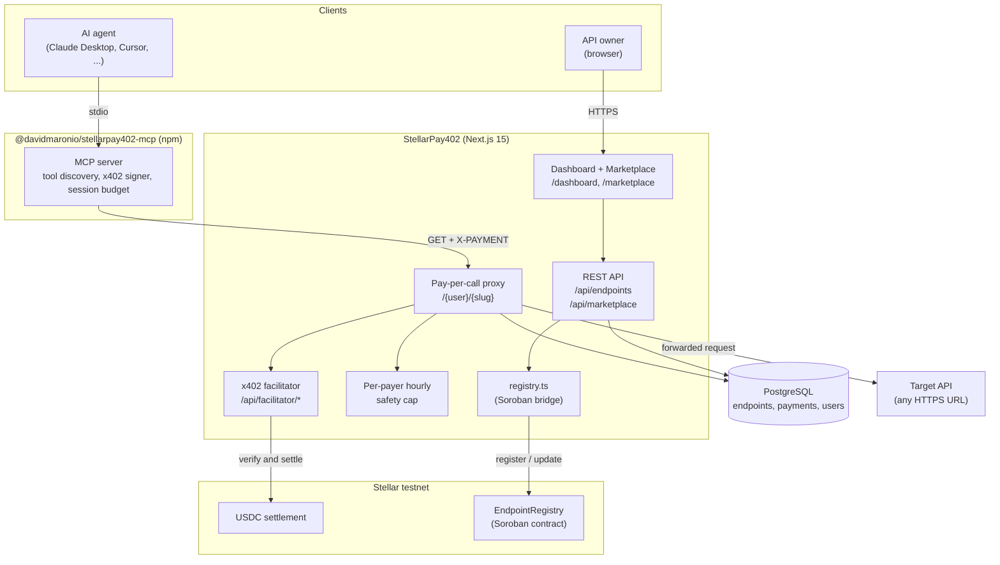

# StellarPay402

StellarPay402 is a marketplace for paid HTTP APIs. Developers list an endpoint and set a USDC price. AI agents find it through MCP and pay for it on their own. Payments settle on Stellar testnet using the x402 protocol. Every endpoint also gets saved on chain by a Soroban contract.

I built this for [Stellar Hacks: Agents 2026](https://dorahacks.io).

## Why this exists

Most APIs are free or behind a subscription. Free APIs break or rate limit you. Subscription APIs need a human with a credit card, so an AI agent cannot use them.

HTTP 402 was reserved for "Payment Required" decades ago. Nobody used it until the x402 protocol came along. x402 fixes the protocol part, but three problems remain:

1. **Integration is manual.** If you want to charge for your API, you write your own middleware to verify the payment, forward the request, and settle on chain.
2. **There is no public catalog.** You can only call an x402 endpoint if someone tells you the URL.
3. **Agents still cannot pay alone.** Someone has to write wallet code, sign the transaction, and add the payment header by hand.

StellarPay402 solves all three.

## How it works

StellarPay402 has three kinds of users.

**API owners.** You go to the dashboard, paste your API URL, set a USDC price, and you get a paid proxy URL back. You change nothing on your side.

**People browsing the marketplace.** You can open `/marketplace` and see every paid API on the platform with the price, the owner, and the recent on chain receipts. Each endpoint page shows three integration paths you can copy and paste: curl, JavaScript, or an MCP config block.

**AI agents.** You install the MCP server `@davidmaronio/stellarpay402-mcp` from npm. You add one block to your Claude Desktop config and restart. Every public endpoint in the marketplace shows up as a tool the AI can call. When the AI calls a tool, the MCP server signs the x402 payment for you and returns the API response with a Stellar Expert link to the on chain transaction.

The app also saves every new endpoint on chain through a Soroban contract called `EndpointRegistry`. If the website goes down, you can still rebuild the catalog from Stellar event logs.

## What is in the repo

- A Next.js 15 web app for the marketplace, the dashboard, the public catalog, and the receipts page.
- A pay per call proxy at `/{userSlug}/{slug}` that returns HTTP 402 when nobody has paid yet, then forwards the request to the real API once payment is verified.
- A self hosted x402 facilitator at `/api/facilitator/*` that runs the verify and settle steps using `@x402/stellar`. The app does not depend on a third party facilitator being up.
- The MCP server (`@davidmaronio/stellarpay402-mcp`) that lets any MCP client read and pay for marketplace endpoints.
- A Soroban contract in Rust under `contracts/endpoint_registry/` with `register`, `update`, `attest`, `get`, and `count` functions.

## Architecture



## Project layout

```
StellarPay402/
├── src/app/
│   ├── [userSlug]/[...path]/route.ts      Pay-per-call proxy handler
│   ├── api/facilitator/[[...path]]/       Embedded x402 facilitator
│   ├── api/endpoints/                     Authenticated endpoint CRUD
│   ├── api/marketplace/                   Public catalog + per-endpoint receipts
│   ├── marketplace/                       Public marketplace pages
│   ├── dashboard/                         Authenticated dashboard
│   └── (auth)/                            Login + register
├── src/lib/
│   ├── auth.ts                            better-auth configuration
│   ├── db/                                Drizzle schema + Postgres client
│   └── registry.ts                        Soroban EndpointRegistry bridge
├── mcp-server/                            @davidmaronio/stellarpay402-mcp npm package
├── contracts/endpoint_registry/           Soroban smart contract (Rust)
├── scripts/test-payment.mjs               End-to-end x402 payment test
└── docs/
    └── PRD.md                             Product requirements
```

## What you need

- Node.js 20 or later
- A PostgreSQL database. The Supabase free tier works.
- A Stellar testnet account for the facilitator signer
- Optional: `stellar-cli` and a Rust toolchain if you want to build and deploy the Soroban contract yourself

## Running it locally

```bash
git clone https://github.com/davidmaronio/StellarPay402
cd StellarPay402
cp .env.local.example .env.local
npm install
npx drizzle-kit push
npm run dev
```

Open <http://localhost:3000>. Sign in. Add an endpoint from the dashboard. It shows up at `/{userSlug}/{slug}` and in the public marketplace at `/marketplace` right away.

## Environment variables

| Variable | Required | Description |
| --- | --- | --- |
| `DATABASE_URL` | yes | PostgreSQL connection string |
| `BETTER_AUTH_SECRET` | yes | 32+ character secret for session encryption |
| `BETTER_AUTH_URL` | yes | Public URL of the app, like `http://localhost:3000` |
| `NEXT_PUBLIC_APP_URL` | yes | Same URL but exposed to the client for proxy and MCP snippets |
| `GITHUB_CLIENT_ID` / `GITHUB_CLIENT_SECRET` | no | Turns on GitHub OAuth login |
| `FACILITATOR_SECRET_KEY` | yes | Stellar testnet secret key the facilitator uses to sign settle transactions |
| `STELLAR_RPC_URL` | no | Defaults to `https://soroban-testnet.stellar.org` |
| `STELLAR_FACILITATOR_URL` | no | Defaults to the embedded `/api/facilitator` route |
| `MAX_PAYER_SPEND_PER_HOUR_USDC` | no | Per-payer hourly safety cap. Default is `1.0` |
| `REGISTRY_CONTRACT_ID` | no | Soroban contract ID for the registry. Leave blank to skip on chain anchoring |
| `REGISTRY_SUBMITTER_SECRET` | no | Secret key used to submit registry transactions. Falls back to `FACILITATOR_SECRET_KEY` |

## How a paid call works

```
Caller -> GET /:user/:slug
          (no X-PAYMENT header)
Server -> 402 + x402 payment requirements (Stellar testnet, USDC)

Caller signs an x402 payment with @x402/stellar
Caller -> GET /:user/:slug  (X-PAYMENT: <base64>)
          verify via facilitator, simulate, settle on Stellar
Server -> forward to target URL, return response + X-Payment-Receipt header
```

## Test the whole thing without writing code

The repo ships a small reference client. Run:

```bash
node scripts/test-payment.mjs
```

This script:

1. Creates a fresh Stellar testnet wallet.
2. Funds it through Friendbot.
3. Sets up a USDC trustline.
4. Swaps a small amount of XLM for USDC on the testnet DEX.
5. Calls the proxy without paying. Expects a 402.
6. Builds and signs an x402 payment with the SDK.
7. Calls again with the payment header. Expects a 200.
8. Prints the Stellar Expert link for the settled transaction.

## Spending cap

The proxy has a built in spending cap. After every successful verify, it checks the `payments` table for that payer address. If accepting the new payment would push them over `MAX_PAYER_SPEND_PER_HOUR_USDC` in the last hour, the proxy rejects the request. The cap runs on the server, so a misbehaving client cannot get around it.

## MCP server

See [`mcp-server/README.md`](./mcp-server/README.md) for the install steps. The short version: you add one block to your Claude Desktop config, restart Claude, and every public endpoint in the marketplace shows up as a tool. When the AI calls a tool, the MCP server signs the x402 payment with its own configured wallet and returns the Stellar Expert link in the answer.

## Soroban EndpointRegistry

See [`contracts/endpoint_registry/README.md`](./contracts/endpoint_registry/README.md). When `REGISTRY_CONTRACT_ID` is set, every endpoint creation also submits a `register` transaction to the contract. The contract emits an on chain event with the owner, the payout address, the price in stroops, and the endpoint name. It also has `update` (owner only), `attest` (anyone can leave a reputation note), `get`, and `count`.

## Tech stack

| Layer | Choice |
| --- | --- |
| Framework | Next.js 15 (App Router) |
| Database | PostgreSQL + Drizzle ORM |
| Auth | better-auth |
| Payments | x402 v2 (`@x402/core`, `@x402/stellar`) |
| Smart contract | Soroban, written in Rust |
| MCP runtime | `@modelcontextprotocol/sdk` |
| Deployment | Vercel for the web app, Supabase for the database |

## Docs

- Product requirements: [`docs/PRD.md`](./docs/PRD.md)
- MCP server: [`mcp-server/README.md`](./mcp-server/README.md)
- Soroban contract: [`contracts/endpoint_registry/README.md`](./contracts/endpoint_registry/README.md)

## License

MIT
